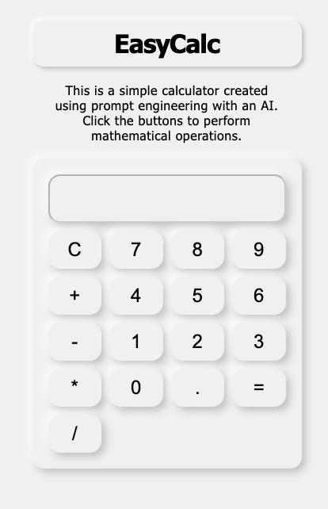

# EasyCalc - Simple Calculator App

EasyCalc is a simple calculator web application developed with HTML, CSS, and JavaScript. It provides basic arithmetic operations and a user-friendly interface.

## Features

- Addition, subtraction, multiplication, and division.
- Neumorphism-style design.
- Dark Mode support.
- Responsive layout for mobile and desktop.

## How to Use

1. Clone this repository to your local machine.
2. Open the `index.html` file in your web browser.
3. Use the calculator to perform arithmetic operations.
4. Click the "Dark Mode" button to switch to Dark Mode.

## Contributing

Contributions are welcome! If you'd like to contribute to this project, please follow these steps:

1. Fork the repository.
2. Create a new branch for your feature: `git checkout -b feature-name`
3. Commit your changes: `git commit -m 'Add new feature'`
4. Push to the branch: `git push origin feature-name`
5. Submit a pull request.

## License

This project is licensed under the MIT License. See the [License.txt](License.txt) file for details.

---

**Note:** This project is for educational purposes and meant to be a simple example of a web-based calculator. It may not be suitable for production use.
